# 🚖 SharedGo  
**Blockchain-Powered AI Cab Pooling Service**

SharedGo is a Flutter-based mobile application developed as part of a hackathon challenge. It provides a **decentralized ride-sharing platform** that leverages the power of **blockchain** and **AI** to ensure secure, efficient, and intelligent cab pooling.

---

## 🧠 Problem Statement

**Problem Statement : Blockchain-Powered AI Cab Pooling Service**

> **Goal**: Develop a decentralized ride-sharing application that ensures secure transactions and efficient ride-matching by integrating blockchain and artificial intelligence.

---

## 🌟 Key Features

- 🔐 **Secure & Transparent Transactions**  
  Every ride and payment is validated via blockchain for enhanced trust and tamper-proof history.

- 🧠 **AI-Powered Dynamic Ride Matching**  
  Our algorithm intelligently matches riders based on proximity, route, and timing—maximizing efficiency.

- 📜 **Smart Contracts for Trust & Fairness**  
  Ride agreements are enforced using self-executing smart contracts, removing the need for intermediaries.

---

## 🚀 Tech Stack

- **Flutter** — Cross-platform mobile UI  
- **Firebase** — Backend (Auth, Realtime DB)  
- **OpenStreetMap API** — Location and route services  
- **AI/ML logic** — Dynamic ride matching  
- *(Planned)* **Blockchain Integration** — Transaction & contract layer  

---

## 📱 Screenshots

| Launcher Icon | Home | Driver Login | User Login |
|---------------|------|--------------|------------|
| 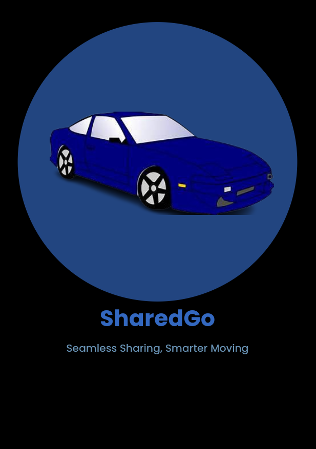 | 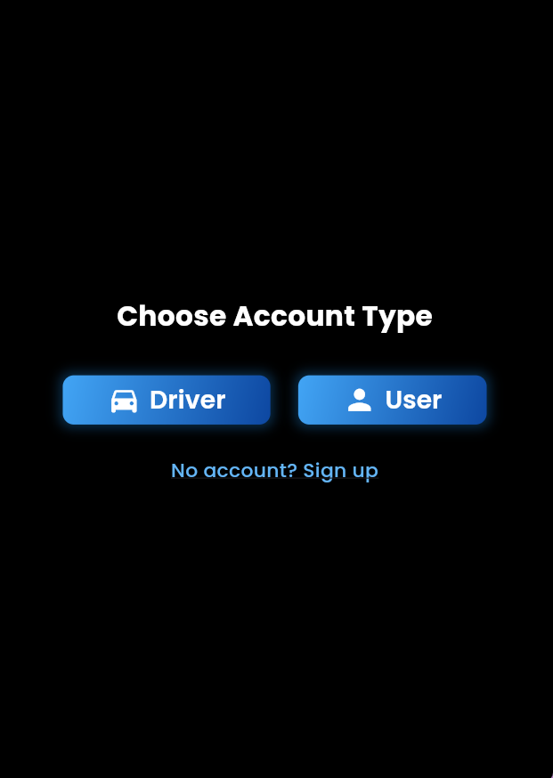 | 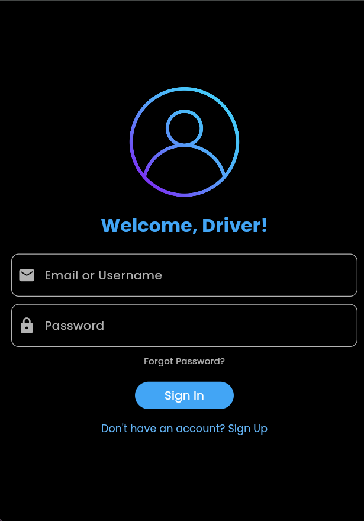 | 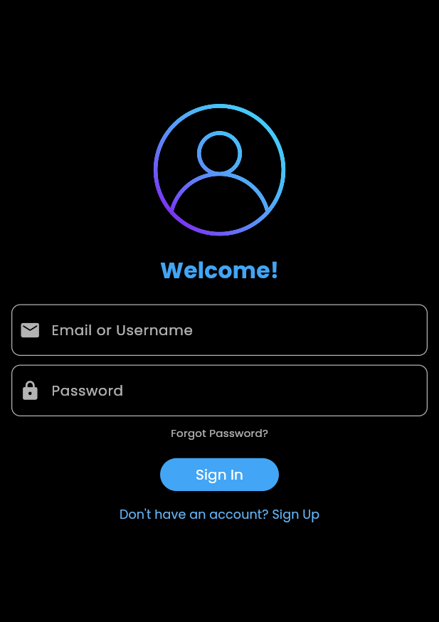 |

| User Home | Taxi Booking | Ride Page | Sign Up |
|-----------|--------------|-----------|---------|
| 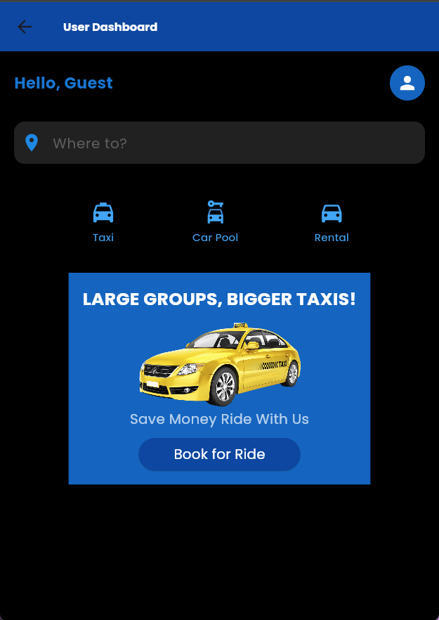 | 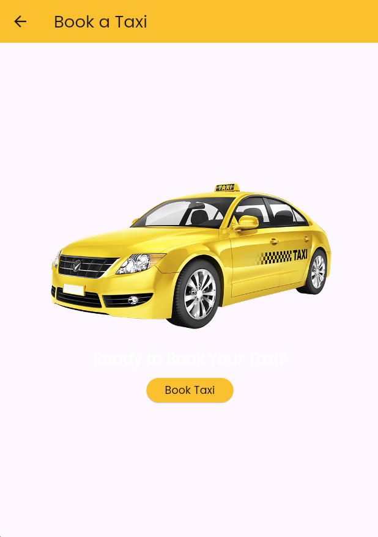 | 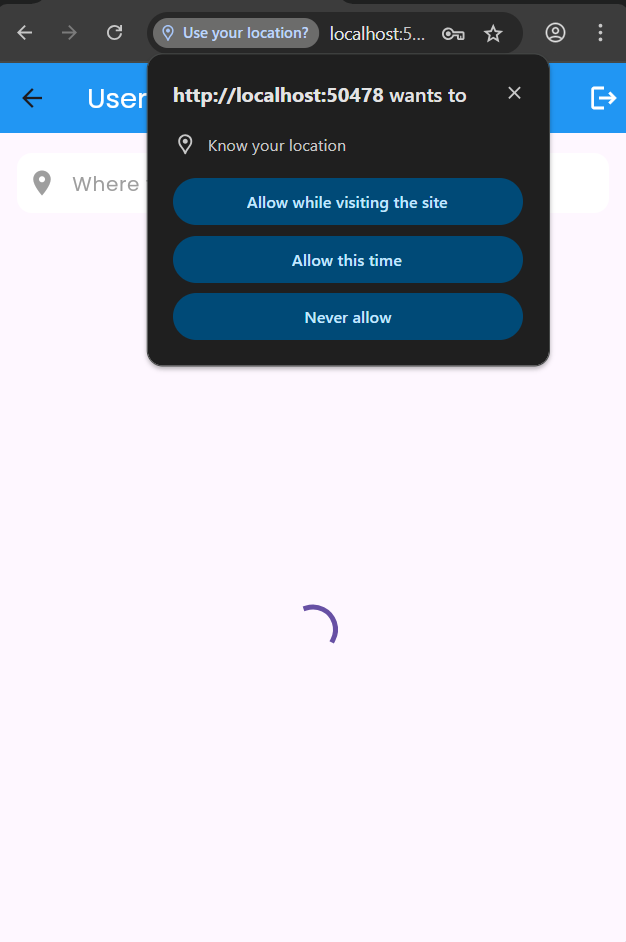 | 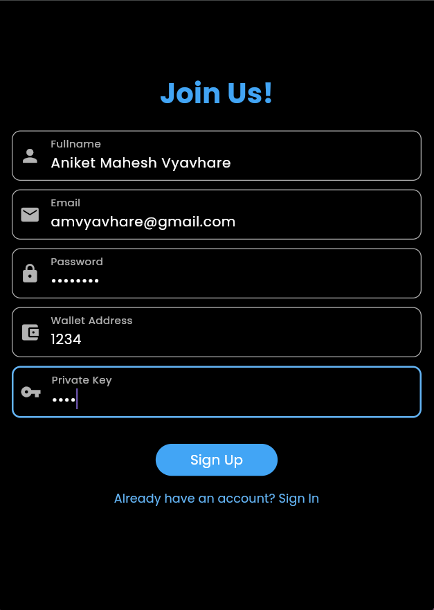 |

| Request Ride | Distance & Fare | Driver Dashboard | User Requests |
|--------------|------------------|------------------|----------------|
| 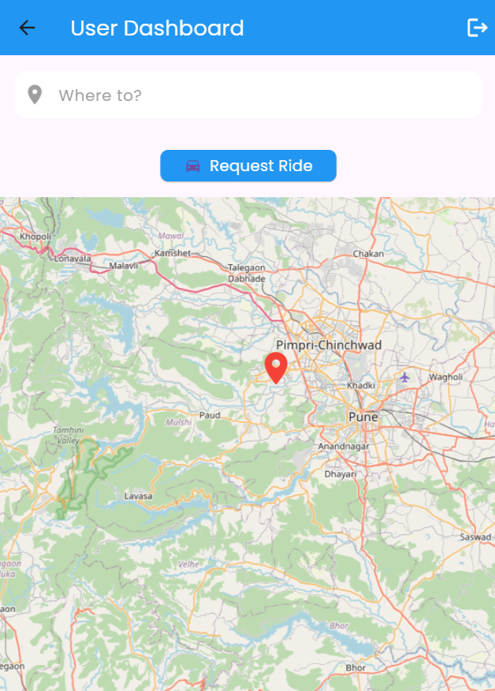 | 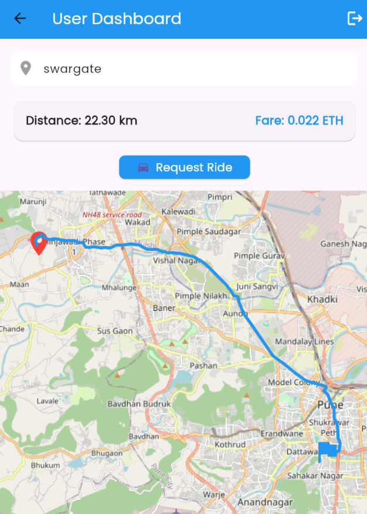 | 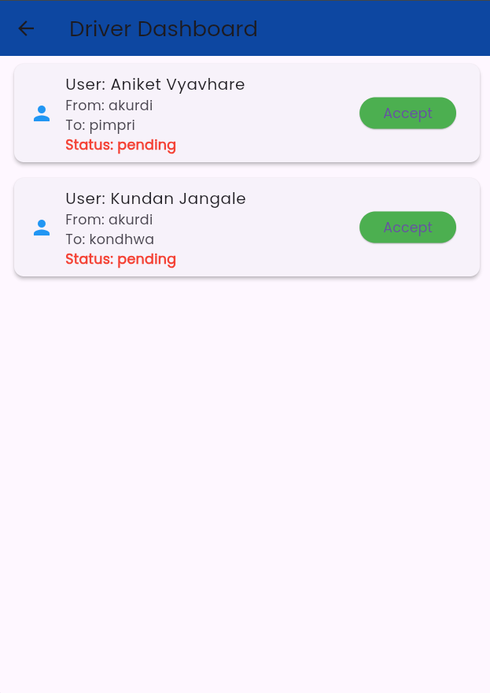 | 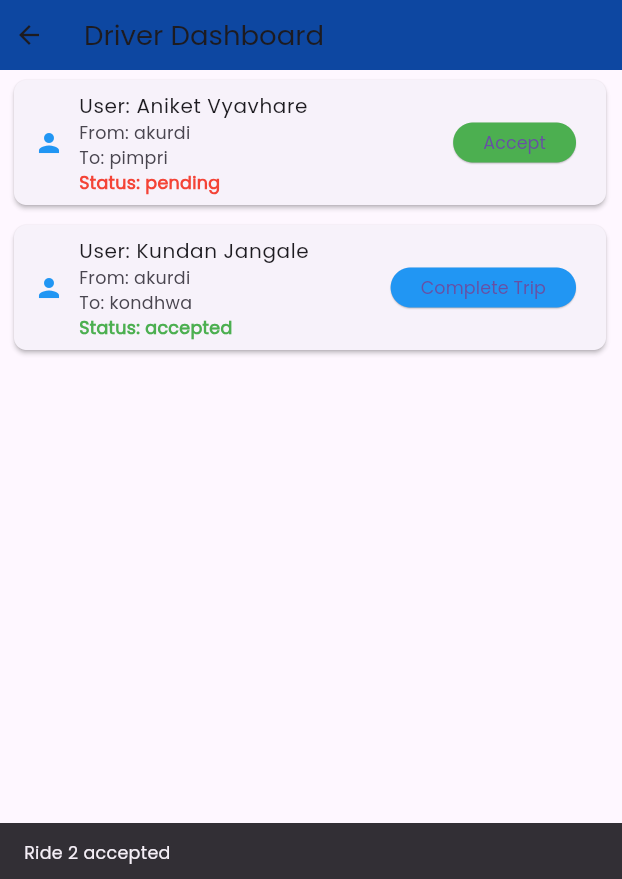 |

---
